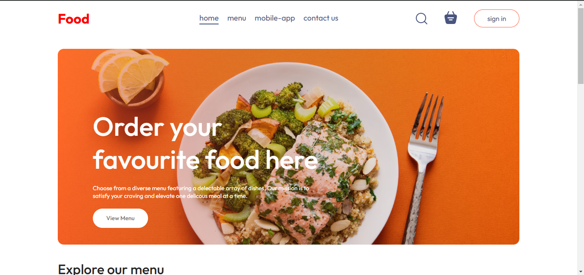

# Basic Food Website Design

This project is a simple food website created with HTML, CSS, and JavaScript. It features a clean and appealing design to showcase various food items and other relevant information for a restaurant or food-related website.

## Features

- **Homepage** showcasing popular dishes and a brief introduction.
- **Basic Animations** and hover effects for a visually engaging user experience.

## Technologies Used

- **HTML** - For structuring the content, sections, and layout of the website.
- **CSS** - For styling, layout design, and basic animations.
- **JavaScript** - For adding interactive elements.

